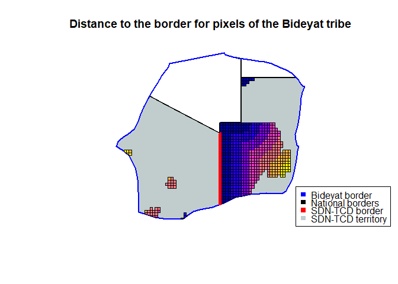
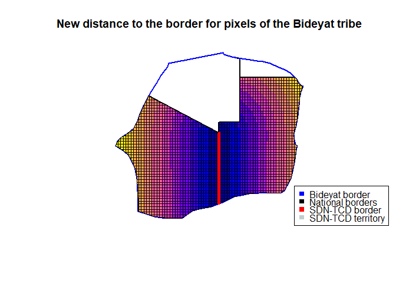
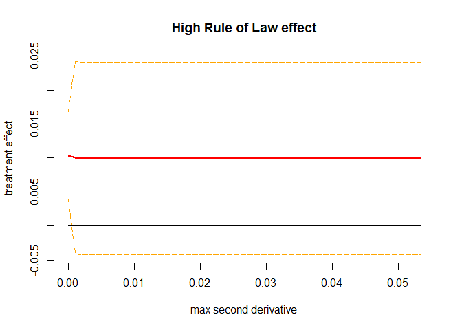
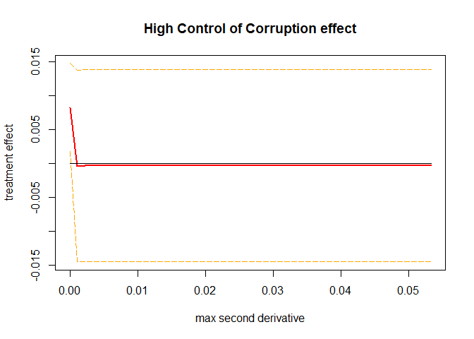
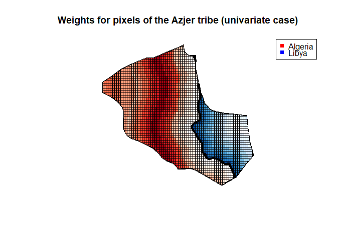
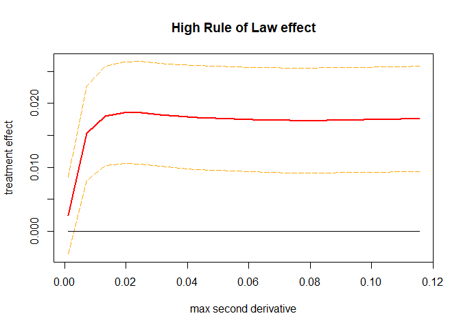
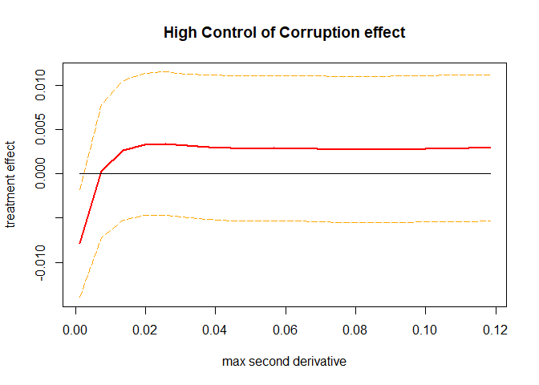
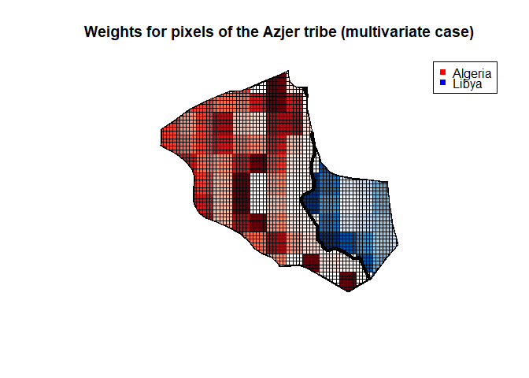

# Optimized Regression Discontinuity Application: the effect of national institutions over local development

## Description
This is my final project for **Stanford's ECON 293: Machine Learning and Causal Inference** for the Spring 2021 quarter. The code used for this project (in RMarkDown) can be found [here](https://github.com/nicolas-suarez/opt_rdd_africa/blob/main/markdown.md) and a write up explaining the project more in detail is available [here](https://github.com/nicolas-suarez/opt_rdd_africa/blob/main/write-up.pdf).

In this project revisit the findings of [Michalopoulos, S., & Papaioannou, E. (2014). National institutions and subnational development in Africa. The Quarterly journal of economics, 129(1), 151-213.](https://academic.oup.com/qje/article-abstract/129/1/151/1897929?redirectedFrom=fulltext). In the mentioned article, the authors explore the role of national institutions on local development levels for in Africa. They exploit the fact that the national boundaries of African countries drawn during their independence partitioned more than 200 ethnic groups across adjacent countries, so within the territory of an ethnic group we have individuals subjected to similar cultures, residing in homogeneous geographic areas, but that are exposed to different national institutions.

We can use a Geographical regression discontinuity design (as the authors do in Section IV.C of their paper) to see the effect of exposure to different levels of institutions over local development levels, measured with satellite images of light density at night, and using as a running variable the distance to the national border partitioning a ethnicity.

The authors use 3rd and 4th degree RD polynomials, define the bandwidth of their RD design in arbitrary ways, and there are some pixels were the distance to the border is not computed properly, so to overcome those flaws and check how robust their findings are, I plan to use the [optrdd package](https://github.com/swager/optrdd) from [Imbens, G., & Wager, S. (2019). Optimized regression discontinuity designs. Review of Economics and Statistics, 101(2), 264-278.](https://arxiv.org/pdf/1705.01677.pdf) to estimate an Optimized Regression Discontinuity model, a data-driven model that doesn't rely on polynomial or bandwidth definition. 

## Empirical design

Before diving into the issues with the dataset, I will first explain the empirical design for this project. Here, our unit of analysis are patches of 12.6 by 12.6 km of land in Africa. Our dependent variable is a dummy indicating if a pixel is lit or not, according to 2007-2008 satellite night lights measures. Our treatment variable is a dummy indicating if a pixel is on the side of the ethnic tribe territory with higher national institutions (measured as either Rule of Law or Control of Corruption).

Besides that main variables, the authors also control for population density in their original article, and they also have information about the country and tribe where a pixel is located, and some information related to its geography, like elevation, presence of water, a malaria index, and similar stuff.

## Data sources

I obtained the original pixel-level dataset from [Stelios Michalopoulos' website](https://drive.google.com/file/d/1UZzwCmT7RZ7JCSx-NXAfu_-n5i6xkjRr/view?usp=sharing). I obtained the shapefiles for the ethnic tribes from [Nathan Nunn's website](https://scholar.harvard.edu/files/nunn/files/murdock_shapefile.zip). The shapefile with the grid of pixels covering Africa was provided directly by Stelios Michalopoulos.

## Problems with the current data
In the current dataset downloaded from the authors website, there are some problems with how the distance to the border is calculated, and they are also missing a lot of pixels, since they discarded all uninhabited pixels. We can illustrate these problems by looking at the Bideyat tribe, located in the border shared among Egypt, Sudan, Chad and Libya. Most of the pixels are in Sudan and Chad, so the authors considered only those 2 countries for their analysis.

In following figure we are going to plot the distance to the border for the pixels in Chad (left) and Sudan (right), where blue pixels are the closest, and yellow are the farthest from the national border. Here we can observe that the distance to the border is clearly calculated in the wrong way: we have around 10 pixels at the top of Sudan, in the frontier with Egypt, that are marked to be less than 50 km to the border between Sudan and Chad, but they are around 200 kilometers away from the mentioned border. Their distance to the border was very likely computed around the wrong border.

<!-- -->

As mentioned before, another problem present in this dataset is that there are a lot of missing pixels: in our previous figure we can see a lot of areas with very little pixels. If we check how many pixels we have per country in the Bideyat territory: there are 598 pixels in Sudan, but only 38 pixels in Chad, and we even have 45 pixels in Egypt, a country that should not be considered here given the approach of the authors.

The imbalance present here could be quite problematic, because we have relatively very little pixels in Chad compared to Sudan, and also because the pixels in Chad are not very close to the border, so a regression discontinuity analysis is not going to produce interesting results here. 

## Replicating and fixing the dataset
Given the previous problems, before trying to estimate causal effects, I'm going to rebuild from scratch the dataset, fixing some issues and expanding the number of units in our sample. I will do the following:

1. I'm going to start by loading the original grid of pixels for Africa.
2. To that grid I will add information about nightlights (average of the DMSP OLS for the years 2007 and 2008) and population density (Population density in 2000).
3. After that, I will also used GIS methods to identify in which country and tribe is every pixel located.
4. With that information, and to use a similar sample to the original one, for each partitioned tribe, I will compute the distance to the national border. To follow Michalopoulos & Papaioannou (2014), I will only consider the two biggest countries in term of area inside a tribe if there are more than 2 countries in the partitioned territory.
5. Finally, using the country and tribe names, I will recover the Rule of Law and Control of Corruption treatment variables from the original dataset, as well as the clustering variable (variable used by the authors and defined in the original ethnographic Atlas of Murdock that groups similar tribes into bigger groups).

With this procedure we pass from an original sample with 40,209 observations, to a new sample with valid information for 55,055 observations. To check that we did everything properly when rebuilding the dataset, in next figure we can see again the distance to the border for the Bideyat tribe, but for the new dataset. We can see that we have data for all pixels in both Chad and Sudan, and that the distance to the border is now computed with respect to the right border.

<!-- -->

## Comparing the different samples

I also replicate the original results of estimating equation (3) of Michalopoulos & Papaioannou (2014), that are displayed in their Table VI. To keep things short, those results are only available in the write-up and the knitted version of the RMarkDown code.

# Univariate Optimized RDD

Now that we checked that our new sample is almost identical to the original sample, we can use our optimized RDD methodology on it. In this section I will use the univariate version of the optimized RDD method, estimating a model where the univariate running variable is the distance of the pixels to the national border. We previously computed the distance to the border, and I now modified that variable so the distance is negative for the pixels on the side of the border with lower Rule of Law or Control of Corruption.An advantage of doing this analysis first is that since we use the same running variable as the original paper, we should obtain comparable results, or at least more similar results than when we change to a multivariate running variable.

To compute the curvature bound $B$ in this univariate case, we will follow Imbens and Wager (2019) and fit a global quadratic model for both treated and control samples. We get the absolute values of the coefficients, and then we keep as our curvature bound the maximum between the 2 quadratic coefficients. In this application there might be significant heterogeneity in the curvature between tribes, so I will also estimate the curvature within every tribe. I will discard the `NA` and `0` values obtained for the curvature bound, and then these values are going to be used for a sensitivity analysis. Specifically, for each treatment variable (high Rule of Law or high Control of Corruption) I will estimate the effect of institutions over local development using distance to the border as my running variable, and using the `optrdd` package. I set the estimation point at 0 (the national border within every tribe). I will do this for 50 values of our curvature bound $B$, ranging from the minimum to the maximum of the within tribe curvatures computed with the global quadratic model. For each model, besides recovering the treatment effect, we also obtain a 95% confidence interval.

In the 2 next figures we can see the results of these sensitivity analysis: we can notice that for both of our institutional quality treatment variables the confidence intervals contain 0, so neither of them is statistically significant for most of the values of $B$.

<!-- -->

<!-- -->

We can also plot our weights to see how they look for a particular tribe (given the number of tribes, looking at all the tribes simultaneously is not feasible). To do this, I will estimate the model using the Rule of Law treatment variable, and for the curvature bound $B$ I use the curvature obtained when we use the global fit model for all the sample. In the following figure we can see the weights for the Azjer tribe, and we can notice that the weights for this tribe look a little weird. For the pixels in Libya there is a clear gradient, and the biggest weights are towards the border, whereas the weights in Algeria look weird, giving a lot of weight to pixels in the center of the partition, but not in the border.

<!-- -->

# Multivariate Optimized RDD
Now we will proceed to estimate a multivariate optimized RDD. We are going to estimate constant treatment effects, and we will use the latitude and longitude of the centroids of the pixels as the running variables.

To estimate the curvature bound $B$, I'm going to follow the code from the geographic RDD example in Imbens and Wager (2019). Here I will use a slightly modified version of their  `get_curvature` function, used to ran a cross-validated ridge regression with interacted 7th-order natural splines as features in each side of the border, and then use this to get a worst-case local curvature. Here I apply the function to the whole sample for both of the treatment variables, and I don't estimate individual curvatures for the different tribes, since a lot of them have too little observations to produce reliable results with a technique like this.

With this function, we can proceed to estimate our multivariate optimized RDD: for each treatment variable (high Rule of Law or high Control of Corruption) I will estimate the effect of institutions over local development using the latitude and longitude of my pixels as my running variables. I will do this for 20 values of our curvature bound, between $0.1B$ and $10B$, where the original curvature $B$ is computed with the `get_curvature` function separately for each of the treatment variables. For each model, besides recovering the treatment effect, we also obtain a 95% confidence interval.

In the two following figures we can see the results of these sensitivity analysis: we can notice that for Rule of Law generates a positive and mostly statistically significant effect, but when our treatment is defined by Control of Corruption the effect becomes not statistically significant.

<!-- -->

<!-- -->

Finally, we can also plot our weights to see how they look for a particular tribe. To do this, I will estimate the model using the Rule of Law treatment variable with maximum curvature $B$. In the next figure we can look again at the weights for the Azjer tribe, and in this case the pixels look a little weird, since there is not a clear gradient towards the border. I believe this is because this method might not work with multiple geographies at the same time, since there is nothing preventing the program to compare pixels among tribes and ignore the tribe borders.

<!-- -->

# Concluding remarks

In this project I revisited the findings of Michalopoulos & Papaioannou (2014). I started by fixing some problems with their data, and then replicating their results with the new data to see if the replication was working properly. Using their methodology I found no statistically significant effect of institutions over local development in any of the samples.

After that, I applied the Optimized Regression Discontinuity Design method with an univariate running variable, the distance to the border, using a wide range of curvature bounds $B$ derived from a within-tribe curvature analysis. Again I found no statistically significant effect.

Finally, I applied the Optimized Regression Discontinuity Design method with an multivariate running variable, the latitude and longitude of pixels, and I derived the curvature bound using the non-parametric global method described in Imbens and Wager (2019). This time around I found that there is a positive and statistically significant effect of national institutions over development when we define institutions as Rule of Law, but that effect disappears when we measure institutions with Control of Corruption. These last findings are very relevant, since they challenge the previous evidence regarding this topic.

However, I interpret these results with caution: I'm not fully sure of how well the multivariate running variable RDD method works here, since we are analyzing several geographical units at the same time, but the model doesn't explicitly defines in which tribe a pixel is. This could lead to comparisons of pixels among different tribes, and the optimization process could end up ignoring completely the national borders that split tribes. There is more work to be done here to adapt this method to this geographical setting with multiple units, maybe related to re-centering the coordinates of each pixel, or adding more explicit constraints into the optimization problem.

Another possible point to improve is the curvature bound $B$ for the multivariate case: I ended up estimating just 1 bound, so it would be very interesting to develop methods to estimate the curvature bound in a way that it takes into account the local curvatures for each tribe.
