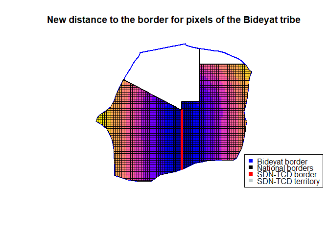
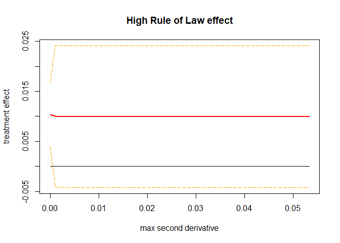
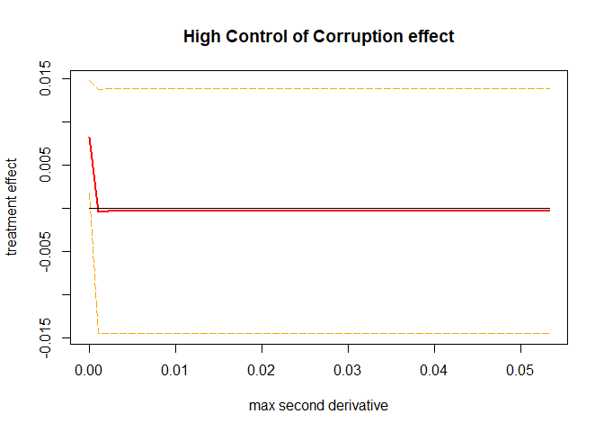
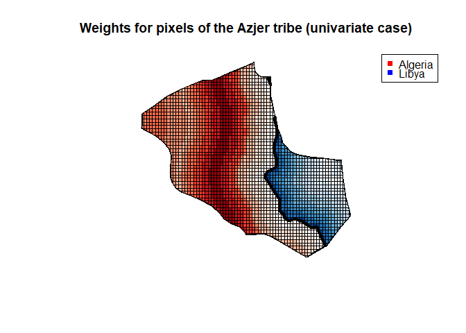
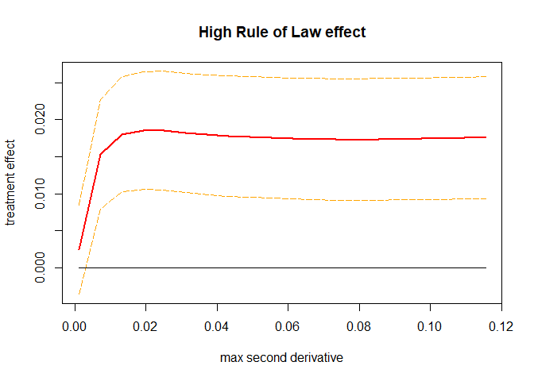
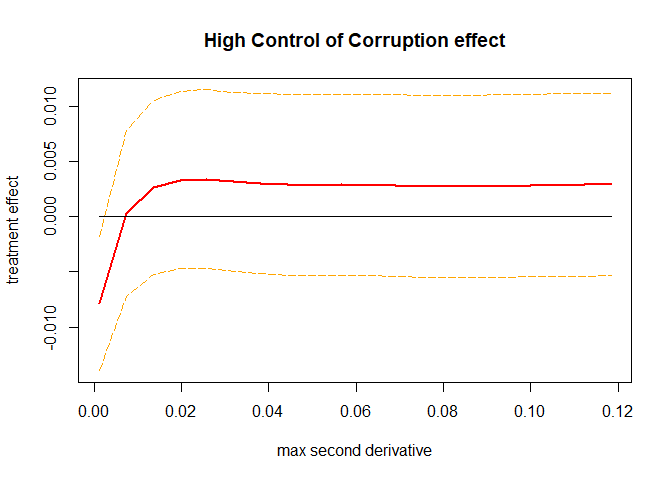
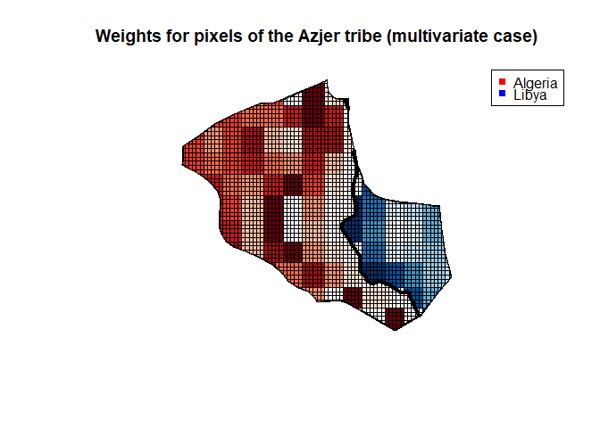

Optimized Regression Discontinuity Application: the effect of national
institutions over local development
================
Nicolas Suarez
5/23/2021

# Description

This is my final project for **Stanford’s ECON 293: Machine Learning and
Causal Inference** for the Spring 2021 quarter.

Here I revisit the findings of [Michalopoulos, S., & Papaioannou, E.
(2014). National institutions and subnational development in Africa. The
Quarterly journal of economics, 129(1),
151-213.](https://academic.oup.com/qje/article-abstract/129/1/151/1897929?redirectedFrom=fulltext).
In the mentioned article, the authors explore the role of national
institutions on local development levels in Africa. They exploit the
fact that the national boundaries of African countries drawn during
their independence partitioned more than 200 ethnic groups across
adjacent countries, so within the territory of an ethnic group we have
individuals subjected to similar cultures, residing in homogeneous
geographic areas, but that are exposed to different national
institutions.

We can use a Geographical regression discontinuity design (as the
authors do in Section IV.C of their paper) to see the effect of exposure
to different levels of institutions over local development levels,
measured with satellite images of light density at night, and using as a
running variable the distance to the national border partitioning a
ethnicity.

The authors use 3rd and 4th degree RD polynomials, define the bandwidth
of their RD design in arbitrary ways, and there are some pixels were the
distance to the border is not computed properly, so to overcome those
flaws and check how robust their findings are, I plan to use the [optrdd
package](https://github.com/swager/optrdd) from [Imbens, G., & Wager, S.
(2019). Optimized regression discontinuity designs. Review of Economics
and Statistics, 101(2), 264-278.](https://arxiv.org/pdf/1705.01677.pdf)
to estimate an Optimized Regression Discontinuity model, a data-driven
model that doesn’t rely on polynomial or bandwidth definition.

## Setting environment

``` r
library(foreign)
library(sf)
library(tidyverse)
library(giscoR)
library(rmapshaper)
library(fixest)
library(optrdd)
library(xtable)
library(glmnet)
library(splines)
library(RColorBrewer)
```

# Data sources

I obtained the original pixel-level dataset from [Stelios Michalopoulos’
website](https://drive.google.com/file/d/1UZzwCmT7RZ7JCSx-NXAfu_-n5i6xkjRr/view?usp=sharing).
I obtained the shapefiles for the ethnic tribes from [Nathan Nunn’s
website](https://scholar.harvard.edu/files/nunn/files/murdock_shapefile.zip).
The shapefile with the grid of pixels covering Africa was provided
directly by Stelios Michalopoulos.

## Importing files

``` r
#M & P (2014) original Stata replication file with pixel id for the grid
dataset = read.dta("pix_ready.dta")
#shapefile for the Murdock ethnic tribes
tribe_borders = st_read("tribes/borders_tribes.shp") %>% st_transform(3857)
# M & P (2014) grid of pixels for Africa
grid = st_read("grid/pixels_africa.shp")  %>% st_transform(3857)
grid = grid[,c("FID_idspli")]

#getting maps of Africa from GISCO (Geographic Information System of the COmmission) from Eurostat
africa <- gisco_get_countries(region = "Africa", resolution = 10) %>% st_transform(3857)

#getting GADM maps of Sudan and Egypt, so our Africa map contains the Halaib Triangle 
#(disputed zone between Sudan and Egypt)
#we simplify the maps to keep 0.15% of the points
sudan <- readRDS(gzcon(url("https://biogeo.ucdavis.edu/data/gadm3.6/Rsf/gadm36_SDN_0_sf.rds"))) %>% ms_simplify(keep=0.0015) %>% st_transform(3857)
egypt  <- readRDS(gzcon(url("https://biogeo.ucdavis.edu/data/gadm3.6/Rsf/gadm36_EGY_0_sf.rds")))%>% ms_simplify(keep=0.0015) %>% st_transform(3857)

#adding the maps of Sudan and Egypt to the map of Africa
africa[africa$ISO3_CODE=="SDN",6] <- sudan[,3]
africa[africa$ISO3_CODE=="EGY",6] <- egypt[,3]

# combining original dataset with grid
dataset=merge(dataset,as.data.frame(grid),by="FID_idspli")
dataset_sf=st_as_sf(dataset)
```

## Problems with the current data

In the current data, there are some problems with how the distance to
the border is calculated. We can illustrate this with the Bideyat tribe,
located in the border shared among Egypt, Sudan, Chad and Libya. Most of
the pixels are in Sudan and Chad, so the authors considered only those 2
countries for their analysis.

Here we are going to plot the distance to the border for the pixels in
Chad (left) and Sudan (right):

``` r
par(xpd=TRUE)
#country and tribe borders
plot( st_intersection(africa[africa$ISO3_CODE %in%  c("TCD","EGY","SDN","LBY"),6],
                      tribe_borders[tribe_borders$NAME=="BIDEYAT",5]),
                      lwd=2, main="Distance to the border for pixels of the Bideyat tribe")
#Sudan and Chat terrain within the Bideyat territory
base_terrain=st_intersection(africa[africa$ISO3_CODE %in% c("TCD","SDN"),6],tribe_borders[tribe_borders$NAME=="BIDEYAT",5])
plot(base_terrain,col="azure3",add=T)
#outlining tribe border
plot(tribe_borders[tribe_borders$NAME=="BIDEYAT",5],border="blue",lwd=2,add=T)
#pixels with distance to the border
plot(st_intersection(dataset_sf[dataset_sf$name=="BIDEYAT",c("bdist")],base_terrain),add=T)
#Sudan and Chad borderline
common_border=st_intersection(st_buffer(africa[africa$ISO3_CODE=="SDN",6],500),
                              st_buffer(africa[africa$ISO3_CODE=="TCD",6],500))
plot(st_intersection(tribe_borders[tribe_borders$NAME=="BIDEYAT",5],common_border), border="red",lwd=4,add=T)
#adding legend
legend("bottomright",, legend=c("Bideyat border","National borders","SDN-TCD border", "SDN-TCD territory"),
       col=c("blue","black","red","azure3"),pch=15,inset = c(-0.05, 0) )
```

<!-- -->

Here we can observe that distance to the border is clearly calculated in
the wrong way: we have around 10 pixels at the top of Sudan, in the
frontier with Egypt, that are marked to be less than 50 km to the border
between Sudan and Chad, but they are around 200 kilometers away from the
mentioned border. Their distance to the border was very likely computed
around the wrong border.

Another problem present in this dataset is that there are a lot of
missing pixels: in our previous figure we can see a lot of areas with
very little pixels. The authors decided to omit pixels in areas that
were not inhabited. We can check how many pixels we have per country in
the Bideyat territory:

``` r
table(dataset[dataset$name=="BIDEYAT",c("wbcode")])
```

    ## 
    ## EGY SDN TCD 
    ##  45 598  38

We can see that we have 598 pixels in Sudan, but only 38 pixels in Chad,
and we even have 45 pixels in Egypt, a country that should not be
considered here given the approach of the authors. The imbalance present
here could be quite problematic, because we have relatively very little
pixels in Chad compared to Sudan, and also because the pixels in Chad
are not very close to the border, so a regression discontinuity analysis
is not going to produce interesting results here.

## Fixing the dataset

Given the previous problem, before estimating causal effects, I’m going
to fix some issues with the dataset, but at the same time I will try to
generate a comparable dataset:

-   I’m going to compute nightlights (average of the DMSP OLS for the
    years 2007 and 2008) and population density (Population density
    in 2000) for the whole grid.
-   I will re-compute distance to the border, so we can have a benchmark
    result with distance to the border fixed. I will do this only for
    the tribes that the authors use, and for each tribe, I will consider
    the same countries as the authors. We could compare all the
    partitions within a tribe if there are more than 2 countries in a
    tribe, but to keep things comparable we are not going to do that.

## Adding nightlights, population density, and modifying countries

``` r
#adding to the grid information about population density, night lights, country and tribe
grid=merge(as.data.frame(grid),read.csv("full_grid.csv"),by="FID_idspli") %>% st_as_sf
#nightlights dummy
grid$l0708d=as.numeric(grid$nl0708>0)
#log of population density
grid$lnpd0=log(grid$pd2000+0.01)
#combining the shapes of Sudan and South Sudan (to match the paper)
africa[africa$ISO3_CODE=="SDN",6] <- st_union( africa[africa$ISO3_CODE=="SDN",6], africa[africa$ISO3_CODE=="SSD",6] )
africa= africa[africa$ISO3_CODE!="SSD", ]
#changing the ISO3 code of the Democratic Republic of Congo (to match the paper)
africa[africa$ISO3_CODE == "COD",c("ISO3_CODE")] <- "ZAR"
```

## Selecting the sample used by the authors

As we mentioned before, we will work only with the sample selected by
the authors. We will do this to get the list of tribes they used, and to
see what countries they considered to be the 2 biggest within each
tribe.

I use the `d2im76` variable to do this, a dummy variable for the Hamama
tribe that the authors use to restrict their sample in their replication
files.

``` r
#defining the main sample (using the same criteria as the authors)
main_sample=dataset[!is.na(dataset$d2im76),]
#marking observations in our grid that should be used now
grid$original_sample= as.numeric(grid$FID_idspli %in% main_sample$FID_idspli)
```

## Computing the true distance to the border

To compute the true distance to the border, I will retrieve a list of
all the tribes considered in the `main_sample` dataset, for each tribe I
will see which countries are considered as the 2 main countries present
there, intersect the shapes to get the common border within the tribe
territory, and then compute the distance to the border for every pixel.

``` r
#empty variable to store distance to the border
grid$bdist= NA

#generating list of tribes to be studied
list_tribes=unique(main_sample$name)

#computing distance to the border for each tribe
for (i in list_tribes) {
  #recovering the countries located in the tribe
  list_countries=unique(main_sample[main_sample$name==i,c("wbcode")])
  #getting shapes of countries
  country_shapes <- africa[africa$ISO3_CODE %in% list_countries,6]
  #computing common border of countries (buffering borders by 500 meters to get the correct shape)
  common_border <- st_intersection(st_buffer(country_shapes[1,],500),st_buffer(country_shapes[2,],500))
  #intersecting common border with the shape of the tribe
  common_border <- st_intersection(common_border, tribe_borders[tribe_borders$NAME==i,5])
  #computing distance to the border (in kilometers)
  grid[(grid$name==i) & (grid$wbcode %in% list_countries),c("bdist")]= st_distance(grid[(grid$name==i) & (grid$wbcode %in% list_countries),c("geometry")],common_border)/1000
}
```

## Visualizing the new distance to the border

Now we are going to visualize again the distance to the border for the
pixels in the Bideyat tribe.

``` r
par(xpd=TRUE)
#country and tribe borders
plot( st_intersection(africa[africa$ISO3_CODE %in%  c("TCD","EGY","SDN","LBY"),6],
                      tribe_borders[tribe_borders$NAME=="BIDEYAT",5]),
      lwd=2, main="New distance to the border for pixels of the Bideyat tribe")
#Sudan and Chat terrain within the Bideyat territory
base_terrain=st_intersection(africa[africa$ISO3_CODE %in% c("TCD","SDN"),6],tribe_borders[tribe_borders$NAME=="BIDEYAT",5])
plot(base_terrain,col="azure3",add=T)
#outlining tribe border
plot(tribe_borders[tribe_borders$NAME=="BIDEYAT",5],border="blue",lwd=2,add=T)
#pixels with distance to the border
plot(st_intersection(grid[grid$name=="BIDEYAT",c("bdist")],base_terrain),add=T)
#Sudan and Chad borderline
common_border=st_intersection(st_buffer(africa[africa$ISO3_CODE=="SDN",6],500),
                              st_buffer(africa[africa$ISO3_CODE=="TCD",6],500))
plot(st_intersection(tribe_borders[tribe_borders$NAME=="BIDEYAT",5],common_border), border="red",lwd=4,add=T)
#adding legend
legend("bottomright",, legend=c("Bideyat border","National borders","SDN-TCD border", "SDN-TCD territory"),
       col=c("blue","black","red","azure3"),pch=15,inset = c(-0.05, 0) )
```

<!-- -->

We can see that the distance to the border (blue pixels are the closest,
and yellow are the most far away) seems correctly calculated.

## Adding the last variables to the dataset

Now we will make the last changes before we start the replication work
and we try new things here. We will compute pixel area, we will recover
the clustering variable used by the authors (categories that contain
similar African ethnic tribes), we will recover for each tribe-country
partition dummies indicating which country within the partition has the
higher and lower Rule of Law and Control of Corruption indexes, and we
will also compute the distance to the border for both sides of the
partitioned tribe.

``` r
grid$area=st_area(grid$geometry)/(1000)^2 #square km
grid$lnkm=log(grid$area) #log of area

#recovering cluster variables and rule of law/control of corruption dummies
grid= merge(as.data.frame(grid),unique(main_sample[,c("name","cluster")]),by="name",all.x=TRUE)
grid= merge(as.data.frame(grid),unique(main_sample[,c("name","wbcode","rlaw_highm","corrupt_highm")]),by=c("name","wbcode"),all.x=TRUE) %>% st_as_sf
#distance to the border polynomial input
main_sample$bdist_hr= main_sample$bdist * (main_sample$rlaw_highm==1)
main_sample$bdist_lr= main_sample$bdist * (main_sample$rlaw_highm==0)
main_sample$bdist_hc= main_sample$bdist * (main_sample$corrupt_highm==1)
main_sample$bdist_lc= main_sample$bdist * (main_sample$corrupt_highm==0)
grid$bdist_hr= grid$bdist * (grid$rlaw_highm==1)
grid$bdist_lr= grid$bdist * (grid$rlaw_highm==0)
grid$bdist_hc= grid$bdist * (grid$corrupt_highm==1)
grid$bdist_lc= grid$bdist * (grid$corrupt_highm==0)
```

## Checking initial results

Before trying new methods here, we will first check if we can replicate
the initial results of the authors. We will start by estimating equation
(3) of the authors:

*y*<sub>*p*, *i*, *c*</sub> = *α*<sub>0</sub> + *γ**I**Q**L*<sub>*c*</sub><sup>*H**I**G**H*</sup> + *f*(*B**D*<sub>*p*, *i*, *c*</sub>) + *λ*<sub>1</sub>*P**D*<sub>*p*, *i*, *c*</sub> + *λ*<sub>2</sub>*A**R**E**A*<sub>*p*, *i*, *c*</sub> + *a*<sub>*i*</sub> + *ε*<sub>*p*, *i*, *c*</sub>
Where *y*<sub>*p*, *i*, *c*</sub> is a dummy that takes value 1 if pixel
*p* in tribe *i* and country *c* is lit, and 0 otherwise,
*I**Q**L*<sub>*c*</sub><sup>*H**I**G**H*</sup> is a dummy indicating
that country *c* has the highest institution quality measure (Rule of
Law or Control of Corruption) within a partitioned tribe,
*f*(*B**D*<sub>*p*, *i*, *c*</sub>) is a 3rd or 4th degree polynomial
function of the running variable, the distance to the border,
*P**D*<sub>*p*, *i*, *c*</sub> is the log of population density,
*A**R**E**A*<sub>*p*, *i*, *c*</sub> is the log of the area of the pixel
and *a*<sub>*i*</sub> is a tribe level fixed effect. The model also
include standard errors double clustered at the cluster (group of
tribes) and country level.

We are going to estimate this using the `feols` command from the
`fixest` library, so we can implement double clustered standard errors.
We are going to estimate this equation in 3 different samples:

-   **Sample 1**: Original dataset with the original distance to the
    border measure.
-   **Sample 2**: Replicated dataset with the new distance to the border
    measure, but only for the pixels used in the original dataset.
-   **Sample 3**: Replicated dataset with the new distance to the border
    measure, for all the pixels in the tribes we are using.

All the coming tables include stars to indicate the significance levels.
If there is no star, it means the p-value is greater than 0.1.

## Rule of Law results, 3rd degree distance to the border polynomial

``` r
reg1=feols( l0708d ~ rlaw_highm + lnpd0 + lnkm +  poly(bdist_hr,degree =3, raw=TRUE) +  poly(bdist_lr,degree =3, raw=TRUE) | name, cluster = ~ wbcode + cluster, data=main_sample )
reg2=feols( l0708d ~ rlaw_highm + lnpd0 + lnkm +  poly(bdist_hr,degree =3, raw=TRUE) +  poly(bdist_lr,degree =3, raw=TRUE) | name, cluster = ~ wbcode + cluster, data=as.data.frame(grid[grid$original_sample==1,]) )
reg3=feols( l0708d ~ rlaw_highm + lnpd0 + lnkm +  poly(bdist_hr,degree =3, raw=TRUE) +  poly(bdist_lr,degree =3, raw=TRUE) | name, cluster = ~ wbcode + cluster, data=as.data.frame(grid) )

etable(reg1,reg2,reg3,se = "twoway",dict=c(rlaw_highm="High Rule of Law"),
       keep="High Rule of Law", fitstat=~n,depvar=FALSE,subtitles = c("Sample 1","Sample 2","Sample 3"))
```

    ##                             reg1            reg2            reg3
    ##                         Sample 1        Sample 2        Sample 3
    ##                                                                 
    ## High Rule of Law 0.0166 (0.0115) 0.0165 (0.0122) 0.0137 (0.0102)
    ## Fixed-Effects:   --------------- --------------- ---------------
    ## name                         Yes             Yes             Yes
    ## ________________ _______________ _______________ _______________
    ## S.E.: Clustered  by: wbco. & c.. by: wbco. & c.. by: wbco. & c..
    ## Observations              40,209          39,848          55,055

## Rule of Law results, 4th degree distance to the border polynomial

``` r
reg4=feols( l0708d ~ rlaw_highm + lnpd0 + lnkm +  poly(bdist_hr,degree =4, raw=TRUE) +  poly(bdist_lr,degree =4, raw=TRUE) | name, cluster = ~ wbcode + cluster, data=main_sample )
reg5=feols( l0708d ~ rlaw_highm + lnpd0 + lnkm +  poly(bdist_hr,degree =4, raw=TRUE) +  poly(bdist_lr,degree =4, raw=TRUE) | name, cluster = ~ wbcode + cluster, data=as.data.frame(grid[grid$original_sample==1,]) )
reg6=feols( l0708d ~ rlaw_highm + lnpd0 + lnkm +  poly(bdist_hr,degree =4, raw=TRUE) +  poly(bdist_lr,degree =4, raw=TRUE) | name, cluster = ~ wbcode + cluster, data=as.data.frame(grid) )

etable(reg4,reg5,reg6,se = "twoway",dict=c(rlaw_highm="High Rule of Law"),
       keep="High Rule of Law", fitstat=~n,depvar=FALSE,subtitles = c("Sample 1","Sample 2","Sample 3"))
```

    ##                             reg4            reg5            reg6
    ##                         Sample 1        Sample 2        Sample 3
    ##                                                                 
    ## High Rule of Law 0.0058 (0.0110) 0.0152 (0.0106) 0.0142 (0.0094)
    ## Fixed-Effects:   --------------- --------------- ---------------
    ## name                         Yes             Yes             Yes
    ## ________________ _______________ _______________ _______________
    ## S.E.: Clustered  by: wbco. & c.. by: wbco. & c.. by: wbco. & c..
    ## Observations              40,209          39,848          55,055

## Control of Corruption results, 3rd degree distance to the border polynomial

``` r
reg7=feols( l0708d ~ corrupt_highm + lnpd0 + lnkm +  poly(bdist_hc,degree =3, raw=TRUE) +  poly(bdist_lc,degree =3, raw=TRUE) | name, cluster = ~ wbcode + cluster, data=main_sample )
reg8=feols( l0708d ~ corrupt_highm + lnpd0 + lnkm +  poly(bdist_hc,degree =3, raw=TRUE) +  poly(bdist_lc,degree =3, raw=TRUE) | name, cluster = ~ wbcode + cluster, data=as.data.frame(grid[grid$original_sample==1,]) )
reg9=feols( l0708d ~ corrupt_highm + lnpd0 + lnkm +  poly(bdist_hc,degree =3, raw=TRUE) +  poly(bdist_lc,degree =3, raw=TRUE) | name, cluster = ~ wbcode + cluster, data=as.data.frame(grid) )

etable(reg7,reg8,reg9,se = "twoway",dict=c(corrupt_highm="High Control of Corruption"),
       keep="High Control of Corruption", fitstat=~n,depvar=FALSE,subtitles = c("Sample 1","Sample 2","Sample 3"))
```

    ##                                       reg7            reg8            reg9
    ##                                   Sample 1        Sample 2        Sample 3
    ##                                                                           
    ## High Control of Corruption 0.0038 (0.0132) 0.0059 (0.0151) 0.0059 (0.0120)
    ## Fixed-Effects:             --------------- --------------- ---------------
    ## name                                   Yes             Yes             Yes
    ## __________________________ _______________ _______________ _______________
    ## S.E.: Clustered            by: wbco. & c.. by: wbco. & c.. by: wbco. & c..
    ## Observations                        40,209          39,848          55,055

## Control of Corruption results, 4th degree distance to the border polynomial

``` r
reg10=feols( l0708d ~ corrupt_highm + lnpd0 + lnkm +  poly(bdist_hc,degree =4, raw=TRUE) +  poly(bdist_lc,degree =4, raw=TRUE) | name, cluster = ~ wbcode + cluster, data=main_sample )
reg11=feols( l0708d ~ corrupt_highm + lnpd0 + lnkm +  poly(bdist_hc,degree =4, raw=TRUE) +  poly(bdist_lc,degree =4, raw=TRUE) | name, cluster = ~ wbcode + cluster, data=as.data.frame(grid[grid$original_sample==1,]) )
reg12=feols( l0708d ~ corrupt_highm + lnpd0 + lnkm +  poly(bdist_hc,degree =4, raw=TRUE) +  poly(bdist_lc,degree =4, raw=TRUE) | name, cluster = ~ wbcode + cluster, data=as.data.frame(grid) )

etable(reg10,reg11,reg12,se = "twoway",dict=c(corrupt_highm="High Control of Corruption"),
       keep="High Control of Corruption", fitstat=~n,depvar=FALSE,subtitles = c("Sample 1","Sample 2","Sample 3"))
```

    ##                                       reg10           reg11           reg12
    ##                                    Sample 1        Sample 2        Sample 3
    ##                                                                            
    ## High Control of Corruption -0.0086 (0.0105) 0.0031 (0.0130) 0.0015 (0.0098)
    ## Fixed-Effects:             ---------------- --------------- ---------------
    ## name                                    Yes             Yes             Yes
    ## __________________________ ________________ _______________ _______________
    ## S.E.: Clustered            by: wbco. & cl.. by: wbco. & c.. by: wbco. & c..
    ## Observations                         40,209          39,848          55,055

We can see that our results for sample 1 match those presented in Table
6 of the paper. The results for sample 2 are pretty similar to those for
sample 1, but we lose a small number of observations due to small
discrepancies with the border of countries, of with pixels falling over
water bodies. The results for sample 3 are slightly different, but are
still not statistically significant.

All of this shows us that even if we fix the distance to the border
issues, it is not enough to change the main results of the paper in a
meaningful way.

# Univariate Optimized RDD results

To get started with the optimized RDD methodology, I will estimate the
model using an univariate running variable, the distance to the border.
We previously calculated the distance to the border, so I will start by
modifying that variable so the distance is negative for the pixels on
the side of the border with lower Rule of Law or Control of Corruption.

I will also select our sample of pixels with valid distance to the
border, and get the latitude and longitude of the centroid of every
pixel.

## Setting our sample

``` r
#getting centroids with lat/lon coordinates
data.nona <- grid %>%  st_transform(4326)
data.nona$centroid = st_centroid(data.nona$geometry)
```

    ## Warning in st_centroid.sfc(data.nona$geometry): st_centroid does not give
    ## correct centroids for longitude/latitude data

``` r
data.nona <- data.nona %>%   mutate(lat = unlist(map(data.nona$centroid,1)),
                               long = unlist(map(data.nona$centroid,2)))
#dropping the geometries from the dataframe
data.nona= dplyr::select(as.data.frame(data.nona), -geometry)
#keeping only observations with valid distance to the border
data.nona=data.nona[!is.na(data.nona$bdist),]
#making distance to the border negative in non-treated side
data.nona$bdist_rlaw=data.nona$bdist
data.nona[data.nona$rlaw_highm==0,c("bdist_rlaw")]=-data.nona[data.nona$rlaw_highm==0,c("bdist_rlaw")]
data.nona$bdist_corrupt=data.nona$bdist
data.nona[data.nona$corrupt_highm==0,c("bdist_corrupt")]=-data.nona[data.nona$corrupt_highm==0,c("bdist_corrupt")]
```

## Computing the curvature

To compute the curvature in this univariate case, we will follow Imbens
and Wager (2019) and fit a global quadratic model for both treated and
control samples. We get the absolute values of the coefficients, and
then we keep as our curvature bound the maximum between the 2 quadratic
coefficients.

In this application there might be significant heterogeneity in the
curvature between tribes, so I will also estimate the curvature within
every tribe. We will discard the `NA` and `0` values obtained for the
curvature bound, and then these values are going to be used for a
sensitivity analysis.

``` r
#computing curvature for distance to the border
rlaw_curvature=max(abs(lm( l0708d ~ rlaw_highm *poly(bdist_rlaw, degree =2, raw=TRUE),
        data = data.nona)$coefficients[c(4,6)]))
corrupt_curvature=max(lm( l0708d ~ corrupt_highm *poly(bdist_corrupt, degree =2, raw=TRUE),
                       data = data.nona)$coefficients[c(4,6)])

#computing per tribe curvature
rlaw_tribe_curvature=c()
corrupt_tribe_curvature=c()
for (i in list_tribes) {
  rlaw_tribe_curvature=c(rlaw_tribe_curvature,max(abs(lm( l0708d ~ rlaw_highm *poly(bdist_rlaw, degree =2, raw=TRUE),
                         data = data.nona[data.nona$name==i,])$coefficients[c(4,6)])))
  corrupt_tribe_curvature=c(corrupt_tribe_curvature,max(abs(lm( l0708d ~ corrupt_highm *poly(bdist_corrupt, degree =2, raw=TRUE),
                            data =  data.nona[data.nona$name==i,])$coefficients[c(4,6)])))
}
#dropping NA and 0 values
rlaw_tribe_curvature=rlaw_tribe_curvature[!is.na(rlaw_tribe_curvature) & rlaw_tribe_curvature>0]
corrupt_tribe_curvature=corrupt_tribe_curvature[!is.na(corrupt_tribe_curvature) & corrupt_tribe_curvature>0]
```

## RDD estimation

Now we have everything to estimate our optimized RDD. For each treatment
variable (high Rule of Law or high Control of Corruption) I will
estimate the effect of institutions over local development using
distance to the border as my running variable, and using the `optrdd`
package. I set the estimation point at 0 (the national border within
every tribe). I will do this for 50 values of our curvature bound *B*,
ranging from the minimum to the maximum of the within tribe curvatures
found in the previous section. For each model, besides recovering the
treatment effect, we also obtain a 95% confidence interval.

``` r
#dataframe to store results for rule of law
rlaw_output=data.frame("B"=seq(min(rlaw_tribe_curvature), max(rlaw_tribe_curvature), length.out = 50))
rlaw_output$tau=NA
rlaw_output$plusminus=NA
rlaw_output$zero=0

#loop to estimate optrdd
for (i in 1:nrow(rlaw_output)) {
  temp=optrdd(X=data.nona$bdist_rlaw, Y=data.nona$l0708d, W=data.nona$rlaw_highm,
              max.second.derivative = rlaw_output$B[i], estimation.point=0 )
  rlaw_output$tau[i]=temp$tau.hat
  rlaw_output$plusminus[i]=temp$tau.plusminus
}

#dataframe to store results for rule of law
corrupt_output=data.frame("B"=seq(min(corrupt_tribe_curvature), max(corrupt_tribe_curvature), length.out = 50))
corrupt_output$tau=NA
corrupt_output$plusminus=NA
corrupt_output$zero=0

for (i in 1:nrow(corrupt_output)) {
  temp=optrdd(X=data.nona$bdist_corrupt, Y=data.nona$l0708d, W=data.nona$corrupt_highm,
              max.second.derivative = corrupt_output$B[i], estimation.point=0 )
  corrupt_output$tau[i]=temp$tau.hat
  corrupt_output$plusminus[i]=temp$tau.plusminus
}
```

## Plotting sensitivity results and weights

I will plot the results of the previous section and make a sensitivity
analysis, and since I will do this several times, I defined the
`sens_optrdd` function to make that process more simple. Now we will see
our treatment effect and a 95% confidence interval:

``` r
#function to plot sensitivity analysis
sens_optrdd = function(df, title) {
  ylim=c(min(df$tau-df$plusminus),max(df$tau+df$plusminus))
  plot(df$B,df$tau,type="l",
       ylim=ylim,ylab="treatment effect",xlab="max second derivative",
       main=title,col="red",lwd=2)
  lines(df$B,df$tau+df$plusminus,col="orange",lty=5)
  lines(df$B,df$tau-df$plusminus,col="orange",lty=5)
  lines(df$B,df$zero)
}
#sensitivity analysis for rule of law
sens_optrdd(rlaw_output,"High Rule of Law effect")
```

<!-- -->

``` r
#sensitivity analysis for control of corruption
sens_optrdd(corrupt_output,"High Control of Corruption effect")
```

<!-- -->

We can notice that for both of our institutional quality treatment
variables the confidence intervals contain 0, so neither of them is
statistically significant for most of the values of *B*.

Finally, we can also plot our weights to see how they look for a
particular tribe (given the number of tribes, looking at all the tribes
simultaneously is not feasible). To do this, I will estimate the model
using the Rule of Law treatment variable, and for the curvature bound
*B* I use the curvature obtained when we use the global fit model for
all the sample. Here, we will plot the weights for the Azjer tribe:

``` r
#optrdd for rule of law, with standard curvature for all the sample
example1=optrdd(X=data.nona$bdist_rlaw, Y=data.nona$l0708d, W=data.nona$rlaw_highm, 
              max.second.derivative = rlaw_curvature ,
              estimation.point=0)
#adding the weights to the grid with the geometries
data.nona$gamma1=example1$gamma
grid=merge(as.data.frame(grid),data.nona[,c("FID_idspli","gamma1")],by="FID_idspli",all.x=TRUE) %>% st_as_sf
```

``` r
#plotting the shapes of countries and tribe
plot( st_intersection(africa[africa$ISO3_CODE %in%  c("LBY","DZA"),6],
                      tribe_borders[tribe_borders$NAME=="AZJER",5]),
      lwd=2, main="Weights for pixels of the Azjer tribe (univariate case)")
#pixels with distance to the border in Libya (in blue)
plot(st_intersection(grid[grid$name=="AZJER",c("gamma1")],africa[africa$ISO3_CODE=="LBY",6]),
     nbreaks=8,breaks = "quantile",pal=brewer.pal(8, "Blues"),add=T)
#pixels with distance to the border in Algeria (in red)
plot(st_intersection(grid[grid$name=="AZJER",c("gamma1")],africa[africa$ISO3_CODE=="DZA",6]),
     nbreaks=8,breaks = "quantile",pal=brewer.pal(8, "Reds"),add=T)
#Algeria and Libya borderline
common_border=st_intersection(st_buffer(africa[africa$ISO3_CODE=="LBY",6],500),
                              st_buffer(africa[africa$ISO3_CODE=="DZA",6],500))
plot(st_intersection(tribe_borders[tribe_borders$NAME=="AZJER",5],common_border), border="black",lwd=4,add=T)
#adding legend
legend("topright",, legend=c("Algeria","Libya"),
       col=c("red","blue"),pch=15 )
```

<!-- -->

We can see that the weights for this tribe look a little weird. For the
pixels in Libya there is a clear gradient, and the biggest weights are
towards the border, whereas the weights in Algeria look weird, giving a
lot of weight to pixels in the center of the partition, but not in the
border.

# Multivariate Optimized RDD

Now we will proceed to estimate a multivariate optimized RDD. We are
going to estimate constant treatment effects, and we will use the
latitude and longitude of the centroids of the pixels as the running
variables.

## Computing the curvature

To estimate the curvature bound *B*, I’m going to follow the code from
the geographic RDD example in Imbens and Wager (2019). Here I will use a
slightly modified version of their `get_curvature` function, used to ran
a cross-validated ridge regression with interacted 7th-order natural
splines as features in each side of the border, and then use this to get
a worst-case local curvature.

``` r
compute_curvature = function(xgrid.pred, nA, nB, centers, binw) {
  curvs0 = sapply(centers, function(idx) {
    c((xgrid.pred[idx + 1] + xgrid.pred[idx - 1] - 2 * xgrid.pred[idx]) / binw^2,
      (xgrid.pred[idx + nA] + xgrid.pred[idx - nA] - 2 * xgrid.pred[idx]) / binw^2,
      (xgrid.pred[idx + nA + 1] + xgrid.pred[idx - nA - 1] - 2 * xgrid.pred[idx]) / binw^2 / 2,
      (xgrid.pred[idx + nA - 1] + xgrid.pred[idx - nA + 1] - 2 * xgrid.pred[idx]) / binw^2 / 2)
  })
  curvs = apply(curvs0, 2, function(iii) max(abs(iii)))
  quantile(curvs, 0.95, na.rm=TRUE)
}

get_curvature = function(xx, outcome, ww, binw = 0.1) {
  
  xx = data.frame(xx)
  yy = outcome
  
  names(xx) = c("A", "B")
  
  gridA = seq(min(xx$A) - 1.5 * binw, max(xx$A) + 1.5 * binw, by = binw)
  gridB = seq(min(xx$B) - 1.5 * binw, max(xx$B) + 1.5 * binw, by = binw)
  xgrid = data.frame(expand.grid(A=gridA, B = gridB))
  xspl.all = model.matrix(~ 0 + ns(A, df = 7) * ns(B, df = 7),
                          data = rbind(xx, xgrid))
  xspl = xspl.all[1:nrow(xx),]
  
  fit0 = cv.glmnet(xspl[ww==0,], yy[ww==0], alpha = 0)
  fit1 = cv.glmnet(xspl[ww==1,], yy[ww==1], alpha = 0)
  
  xgrid.spl = xspl.all[nrow(xx) + 1:nrow(xgrid),]
  xgrid.pred.0 = predict(fit0, xgrid.spl, s="lambda.1se")
  xgrid.pred.1 = predict(fit1, xgrid.spl, s="lambda.1se")
  
  nA = length(gridA)
  nB = length(gridB)
  
  bucketA = as.numeric(cut(xx[,1], gridA))
  bucketB = as.numeric(cut(xx[,2], gridB))
  bucket = bucketA + nA * bucketB
  
  c.hat.0 = compute_curvature(xgrid.pred.0, nA, nB, centers = bucket[ww == 0], binw = binw)
  c.hat.1 = compute_curvature(xgrid.pred.1, nA, nB, centers = bucket[ww == 1], binw = binw)
  max(c.hat.0, c.hat.1)
}
```

## RDD estimation

With this function, we can proceed to estimate our multivariate
optimized RDD: for each treatment variable (high Rule of Law or high
Control of Corruption) I will estimate the effect of institutions over
local development using the latitude and longitude of my pixels as my
running variables. I will do this for 20 values of our curvature bound,
between 0.1*B* and 10*B*, where the original curvature *B* is computed
with the `get_curvature` function for each of the treatment variables.

For each model, besides recovering the treatment effect, we also obtain
a 95% confidence interval.

``` r
#rule of law curvature
max.curv.rlaw = get_curvature(data.nona[,c("lat","long")], data.nona[,c("l0708d")], data.nona[,c("rlaw_highm")])
#dataframe to store results
rlaw_output=data.frame("B"=seq(0.1*max.curv.rlaw, 10*max.curv.rlaw, length.out = 20))
rlaw_output$tau=NA
rlaw_output$plusminus=NA
rlaw_output$zero=0
#loop to compute optrdd for different values of B
for (i in 1:nrow(rlaw_output)) {
  temp=optrdd(X=as.matrix(data.nona[,c("lat","long")]), Y=data.nona[,c("l0708d")], W=data.nona[,c("rlaw_highm")], max.second.derivative = rlaw_output$B[i] )
  rlaw_output$tau[i]=temp$tau.hat
  rlaw_output$plusminus[i]=temp$tau.plusminus
}

#control of corruption curvature
max.curv.corrupt = get_curvature(data.nona[,c("lat","long")], data.nona[,c("l0708d")], data.nona[,c("corrupt_highm")])
#dataframe to store results
corrupt_output=data.frame("B"=seq(0.1*max.curv.corrupt, 10*max.curv.corrupt, length.out = 20))
corrupt_output$tau=NA
corrupt_output$plusminus=NA
corrupt_output$zero=0
#loop to compute optrdd for different values of B
for (i in 1:nrow(corrupt_output)) {
  temp=optrdd(X=as.matrix(data.nona[,c("lat","long")]), Y=data.nona[,c("l0708d")], W=data.nona[,c("corrupt_highm")], max.second.derivative = corrupt_output$B[i] )
  corrupt_output$tau[i]=temp$tau.hat
  corrupt_output$plusminus[i]=temp$tau.plusminus
}
```

## Plotting sensitivity results and weights

I will plot the results of the previous section and make a sensitivity
analysis, using again the `sens_optrdd` function that we defined before.
Now we will see our treatment effect and a 95% confidence interval:

``` r
#sensitivity analysis for rule of law
sens_optrdd(rlaw_output,"High Rule of Law effect")
```

<!-- -->

``` r
#sensitivity analysis for control of corruption
sens_optrdd(corrupt_output,"High Control of Corruption effect")
```

<!-- -->

We can notice that for Rule of Law generates a positive and mostly
statistically significant effect, but when our treatment is defined by
Control of Corruption the effect becomes not statistically significant.

Finally, we can also plot our weights to see how they look for a
particular tribe. To do this, I will estimate the model using the Rule
of Law treatment variable with maximum curvature *B*. Here I will again
plot the weights for the Azjer tribe:

``` r
#optrdd for rule of law, with standard curvature B
example2=optrdd(X=as.matrix(data.nona[,c("lat","long")]), Y=data.nona[,c("l0708d")], W=data.nona[,c("rlaw_highm")], max.second.derivative = max.curv.rlaw )
#adding the weights to the grid with the geometries
data.nona$gamma2=example2$gamma
grid=merge(as.data.frame(grid),data.nona[,c("FID_idspli","gamma2")],by="FID_idspli",all.x=TRUE) %>% st_as_sf
```

``` r
#plotting the shapes of countries and tribe
plot( st_intersection(africa[africa$ISO3_CODE %in%  c("LBY","DZA"),6],
                      tribe_borders[tribe_borders$NAME=="AZJER",5]),
      lwd=2, main="Weights for pixels of the Azjer tribe (multivariate case)")
#pixels with distance to the border in Libya (in blue)
plot(st_intersection(grid[grid$name=="AZJER",c("gamma2")],africa[africa$ISO3_CODE=="LBY",6]),
     nbreaks=10,breaks = "quantile",pal=brewer.pal(10, "Blues"),add=T)
#pixels with distance to the border in Algeria (in red)
plot(st_intersection(grid[grid$name=="AZJER",c("gamma2")],africa[africa$ISO3_CODE=="DZA",6]),
     nbreaks=10,breaks = "quantile",pal=brewer.pal(10, "Reds"),add=T)
#Algeria and Libya borderline
common_border=st_intersection(st_buffer(africa[africa$ISO3_CODE=="LBY",6],500),
                              st_buffer(africa[africa$ISO3_CODE=="DZA",6],500))
plot(st_intersection(tribe_borders[tribe_borders$NAME=="AZJER",5],common_border), border="black",lwd=4,add=T)
#adding legend
legend("topright",, legend=c("Algeria","Libya"),
       col=c("red","blue"),pch=15 )
```

<!-- -->

In this case, the pixels look a little weird, and there is not a clear
gradient towards the border. I believe this is because this method might
not work with multiple geographies at the same time, since there is
nothing preventing the program to compare pixels among tribes and ignore
the tribe borders.
